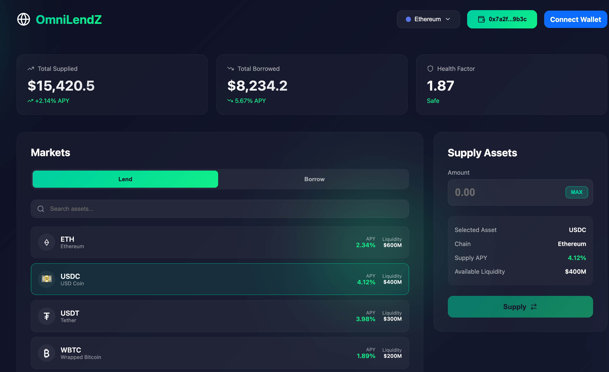

# OmniLendZ - Cross-Chain Lending on ZetaChain

A cross-chain DEX is just one example of an Omnichain dApp. With general message passing and Omnichain Smart Contracts.

## what you get
- `contracts/OmniLendZ.sol`: core lending pool (deposit/borrow/repay/liq) on a single EVM chain (zEVM-like).
- `contracts/GatewayMock.sol`: stand-in for Zeta Gateway (emits events). Replace with real gateway for testnet.
- `contracts/adapters/ChainAdapterMock.sol`: placeholder connected-chain adapter.
- `frontend/`: Vite + React minimal UI: deposit, borrow (emits cross-chain message), repay.
- `bots/liquidator/`: listens to cross-chain intents; extend to implement liquidation logic & Gemini planning.

### **Incoming CCTX (Connected Chain → ZetaChain)**
1. User calls `depositAndCall` on connected chain
2. Message arrives at `onCall()` function on ZetaChain
3. Operation is processed locally on ZetaChain
4. Response is prepared and sent back

### **Outgoing CCTX (ZetaChain → Connected Chain)**
1. `_sendCrossChainResponse()` calls `gateway.withdraw()`
2. ZetaChain broadcasts transaction to connected chain
3. Connected chain executes the response
4. CCTX is tracked and monitored

## 🚀 Deployment

### Prerequisites
- Node.js 16+
- Hardhat
- ZetaChain testnet access (Athens)

### 1. Install Dependencies
```bash
npm install
```

### 2. Configure Environment
Create `.env` file:
```env
PRIVATE_KEY=your_private_key
ZETA_GATEWAY=actual_gateway_address
ZETA_CHAIN_ID=7001
```

### 3. Deploy Contracts

#### Deploy to ZetaChain Testnet
```bash
npx hardhat run scripts/deploy-zeta.ts --network zeta-testnet
```

#### Deploy Client to Connected Chain
```bash
npx hardhat run scripts/deploy-localnet.ts --network sepolia
```

## 🧪 Testing Complete Flow

### **Step 1: Deploy Contracts**
1. Deploy `OmniLendZ` on ZetaChain Athens testnet
2. Deploy `OmniLendZClient` on connected EVM chain (e.g., Sepolia)
3. Note contract addresses

### **Step 2: Setup Markets**
```bash
# List markets on ZetaChain
npx hardhat run scripts/setup-markets.ts --network zeta-testnet
```

### **Step 3: Test Cross-Chain Operations**

#### **Deposit Flow**
```typescript
// 1. Approve tokens
await omniClient.approveTokens(tokenAddress, amount);

// 2. Initiate cross-chain deposit
await omniClient.depositCrossChain(tokenAddress, amount);

// 3. Monitor CCTX status
// Transaction hash → CCTX hash → Operation status
```

#### **Borrow Flow**
```typescript
// 1. Initiate cross-chain borrow
await omniClient.borrowCrossChain(tokenAddress, amount);

// 2. Wait for ZetaChain processing
// 3. Receive borrowed tokens on connected chain
```

### **Step 4: Monitor CCTXs**

#### **Using ZetaChain Block Explorer**
1. Find your transaction hash on connected chain
2. Query CCTX data: `/crosschain/inboundHashToCctxData/{txHash}`
3. Track CCTX status and outbound transactions

#### **Using Contract Functions**
```typescript
// Check operation status
const operation = await omniClient.getOperation(operationHash);

// Get CCTX hash
const cctxHash = await omniClient.getCCTXHash(operationHash);

// Check if CCTX processed
const isProcessed = await omniClient.isCCTXProcessed(operationHash);
```

## 🔍 CCTX Tracking

### **Incoming CCTX Flow**
```
Connected Chain → ZetaChain Gateway → OmniLendZ.onCall()
```

### **Outgoing CCTX Flow**
```
OmniLendZ._sendCrossChainResponse() → Gateway.withdraw() → Connected Chain
```

### **CCTX Hash Resolution**
1. **Inbound Hash**: Transaction hash on source chain
2. **CCTX Hash**: ZetaChain's internal cross-chain transaction ID
3. **Outbound Hash**: Transaction hash on destination chain

## 📊 Testing Scripts

### **Test Complete Flow**
```bash
# Update contract addresses in test-zeta-flow.ts
npx hardhat run scripts/test-zeta-flow.ts --network sepolia
```

### **Monitor Operations**
```bash
# Check operation status
npx hardhat run scripts/monitor-operations.ts --network sepolia
```

## 🚨 Important Notes

### **Before Testing**
1. ✅ Get actual `ZETA_GATEWAY` address from ZetaChain docs
2. ✅ Deploy on Athens testnet (chain ID 7001)
3. ✅ Use test tokens with sufficient balance
4. ✅ Allow 5-15 minutes for cross-chain confirmations

### **Common Issues**
- **Gateway Address**: Must use correct ZetaChain Gateway address
- **Token Approvals**: Ensure sufficient token approvals
- **Gas Limits**: Cross-chain operations require adequate gas
- **Network Sync**: Wait for cross-chain confirmations

## 🔗 Useful Links

- [ZetaChain Documentation](https://docs.zetachain.com/)
- [Athens Testnet Explorer](https://explorer.athens2.zetachain.com/)
- [CCTX API Endpoints](https://docs.zetachain.com/developers/apis/cctx)
- [Gateway Contract Addresses](https://docs.zetachain.com/developers/contracts/addresses)

## 📝 Contract Functions

### **OmniLendZ (ZetaChain)**
- `onCall()` - Entry point for cross-chain messages
- `_sendCrossChainResponse()` - Send responses back to connected chains
- `listMarket()` - Add new lending markets

### **OmniLendZClient (Connected Chain)**
- `depositCrossChain()` - Initiate cross-chain deposit
- `borrowCrossChain()` - Initiate cross-chain borrow
- `onCrossChainResponse()` - Handle responses from ZetaChain

## 🎯 Next Steps

1. **Deploy to Athens testnet** with real Gateway address
2. **Test complete deposit/borrow flow**
3. **Monitor CCTX lifecycle** using block explorer
4. **Implement frontend integration**
5. **Add more complex lending logic**

---

## notes
- price oracle here is mocked via `setPrice(pythId, pxE8)`. swap with Pyth contract in real integration.
- healthFactor implementation is conservative; for hackathon demo stick to one-collateral-one-debt per user.
